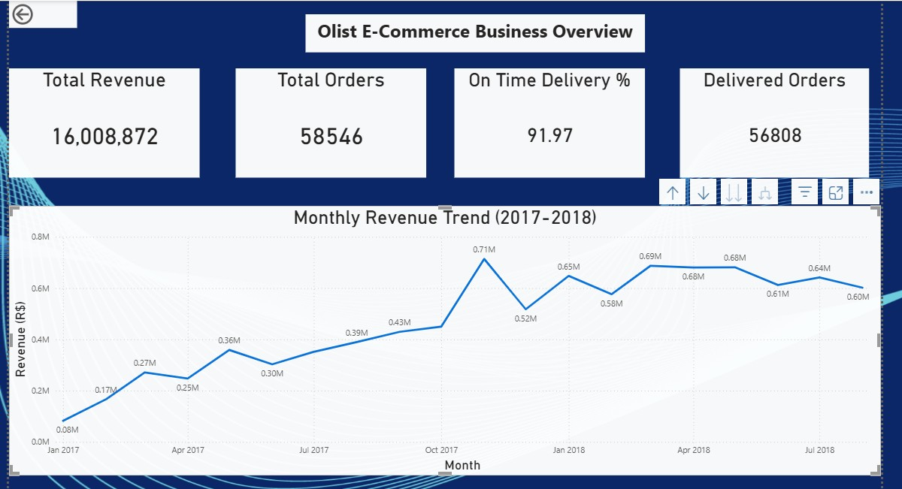

# Olist E-Commerce Performance Analysis

## Project Overview
This project analyzes 100,000+ real transactions from Olist, 
Brazil's largest e-commerce marketplace, to uncover insights 
about revenue trends, delivery performance, customer satisfaction, 
and product category performance.

## Business Problem
Olist connects small Brazilian sellers to major e-commerce 
channels. This analysis answers five key business questions:
- How has revenue trended over time?
- How efficient is order fulfillment and delivery?
- What drives customer satisfaction and dissatisfaction?
- Which sellers generate the most value?
- Which product categories perform best and worst?

## Tools Used
- **MySQL** — data cleaning, transformation and analysis
- **Microsoft Excel** — initial data exploration
- **Power BI** — interactive dashboard and visualization

## Dataset
- Source: [Olist Brazilian E-Commerce Dataset](https://www.kaggle.com/datasets/olistbr/brazilian-ecommerce)
- 9 interconnected tables
- ~100,000 orders
- Period: January 2017 — August 2018

## Data Cleaning Steps
- Imported 9 CSV files into MySQL with correct data types
- Converted empty strings to NULL in date columns
- Identified and removed corrupted hash values in date fields
- Excluded incomplete months (Sep-Oct 2018) from trend analysis
- Applied minimum order thresholds for statistically reliable averages

## Key Findings

### 1. Revenue Performance
- Total revenue: **R$16,008,872**
- Consistent month-on-month growth throughout 2017-2018
- Peak revenue in November 2017 driven by Black Friday
- Post Black Friday dip in December suggests consumers 
  front-load holiday spending

### 2. Delivery Performance
- 97% order fulfillment rate across 58,546 orders
- 91.97% of delivered orders arrived on time
- Approximately 4,500 orders experienced late delivery

### 3. Customer Satisfaction
- Overall average review score: 4.09 out of 5
- 58% of customers gave 5-star reviews
- Late deliveries cause a 34% drop in satisfaction scores
  (4.29 for on-time vs 2.58 for late deliveries)
- This confirms delivery performance as the primary driver
  of negative customer experience

### 4. Seller Performance
- Top seller by orders and top seller by revenue are 
  different sellers — indicating two distinct business 
  models: high volume vs high value
- High volume sellers are not the highest rated sellers
  suggesting a scale vs quality trade-off on the platform

### 5. Product Performance
- health_beauty is the top revenue category at R$1.44M
  with an average order value 40% higher than competitors
- bed_bath_table, computers_accessories and furniture_decor
  appear in both top revenue and bottom satisfaction lists
- security_and_services is the lowest rated category at 2.5
  representing a significant customer experience risk

## Recommendations
1. Prioritize delivery speed improvements — late delivery 
   is the single biggest driver of negative reviews
2. Investigate high volume sellers for operational strain
   that may be impacting service quality
3. Implement category-specific packaging standards for 
   bulky items like furniture and bed/bath products
4. Develop seller coaching program targeting sellers 
   scoring below 3.5 in customer reviews

## Dashboard Preview
### Page 1 — Business Overview

### Page 2 — Delivery & Satisfaction

### Page 3 — Product & Seller Performance

## SQL Queries
All analysis queries are available in the 
[queries.sql](queries.sql) file with comments explaining 
each analysis step.

## Project Structure
olist-ecommerce-analysis/
│
├── README.md
├── queries.sql
└── dashboard-screenshots/
├── page1-business-overview.png
├── page2-delivery-satisfaction.png
└── page3-product-seller.png

## Author
Jane Ng'ang'a 
LinkedIn URL: (https://www.linkedin.com/in/ng-ang-a-jane/)  
jane.nganga.4694@gmail.com
